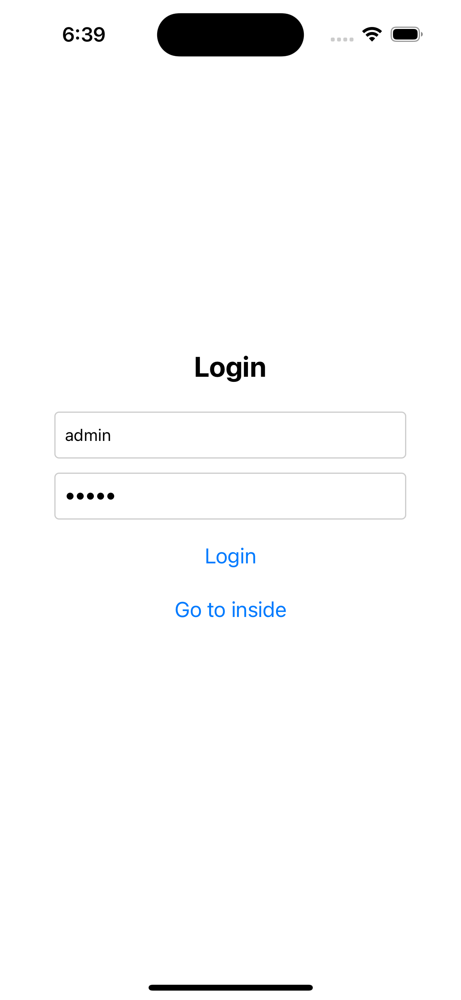
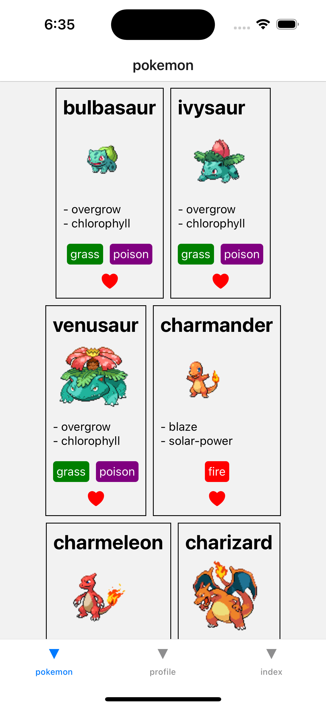
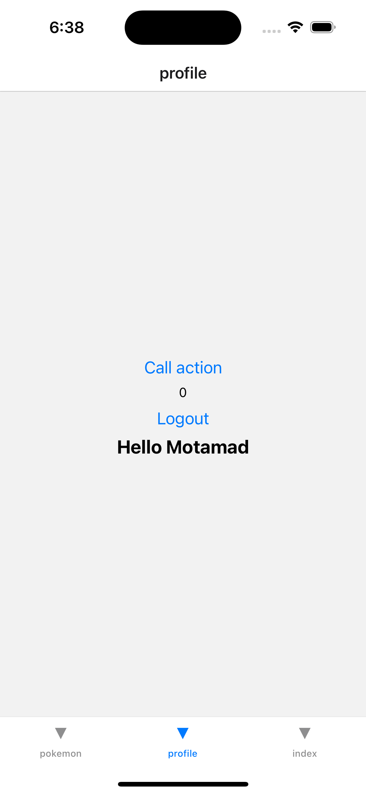

# Expo Router RSC and Authentication Flows

A modern React Native application built with Expo Router 5, featuring React Server Components (RSC) and comprehensive authentication flows with role-based access control.

## 🚀 Features

- **Expo Router 5**: File-based routing with the latest Expo Router features
- **React Server Components**: Server-side rendering capabilities for improved performance
- **Authentication System**: Complete login/logout functionality with context-based state management
- **Role-Based Access Control**: Admin and user role management
- **Protected Routes**: Automatic route protection based on authentication status
- **Modal Navigation**: Sheet and modal presentations for enhanced UX
- **Pokemon API Integration**: Example of server actions with external API calls
- **TypeScript**: Full TypeScript support for better development experience

## 📱 App Screenshots

### Login Screen


*The public login page where users authenticate to access the app*

### Main Dashboard


*Authenticated user dashboard with navigation tabs and quick actions*

### Pokemon Tab


*Pokemon display with types, abilities, and sprites from the PokeAPI*

### Profile Tab


*User profile with authentication actions and server action examples*

### Admin Panel


*Admin-only area accessible to users with admin privileges*

### Modal Presentations


*News modal and sheet presentations with custom styling*

## 📱 App Structure

```
expo-router-rsc/
├── app/                          # App router directory
│   ├── _layout.tsx              # Root layout with authentication guard
│   ├── (public)/                # Public routes (no auth required)
│   │   ├── _layout.tsx         # Public layout
│   │   └── index.tsx           # Login page
│   ├── (authenticated)/         # Protected routes (auth required)
│   │   ├── _layout.tsx         # Authenticated layout
│   │   ├── (tabs)/             # Tab-based navigation
│   │   │   ├── _layout.tsx     # Tab layout
│   │   │   ├── index.tsx       # Home tab
│   │   │   ├── pokemon.tsx     # Pokemon tab
│   │   │   └── profile.tsx     # Profile tab
│   │   └── (modal)/            # Modal presentations
│   │       ├── news.tsx        # News modal
│   │       └── sheet.tsx       # Sheet modal
│   └── admin.tsx               # Admin-only route
├── actions/                     # Server actions
│   ├── pokemon.tsx             # Pokemon API integration
│   ├── render-info.tsx         # Server-side rendering example
│   └── server-action.tsx       # Server action example
├── component/                   # Reusable components
│   └── Types.tsx               # Pokemon type display component
├── provider/                    # Context providers
│   └── AuthProvider.tsx        # Authentication context
└── assets/                     # Static assets
```

## 🛠️ Setup Instructions

### Prerequisites

- Node.js 18+ 
- Bun (recommended) or npm
- Expo CLI
- iOS Simulator or Android Emulator

### Installation

1. **Clone the repository**
   ```bash
   git clone <repository-url>
   cd expo-router-rsc
   ```

2. **Install dependencies**
   ```bash
   bun install
   # or
   npm install
   ```

3. **Start the development server**
   ```bash
   bun expo start
   # or
   npm run expo start
   ```

4. **Run on device/simulator**
   - Press `i` for iOS Simulator
   - Press `a` for Android Emulator
   - Scan QR code with Expo Go app on physical device

## 🔐 Authentication

### Default Credentials

- **Admin User**: `admin` / `12345`
- **Regular User**: Any valid email/password combination

### Authentication Flow

1. **Login**: Users authenticate through the public login page
2. **Route Protection**: Authenticated users can access protected routes
3. **Role Management**: Admin users get access to additional admin routes
4. **Context State**: Authentication state is managed globally through React Context

### Protected Routes

- `(authenticated)/*` - Requires valid authentication
- `admin` - Requires admin role
- `(public)/*` - Accessible without authentication

## 🎯 Key Features Explained

### Server Actions

The app demonstrates React Server Components with server actions:

```typescript
// actions/pokemon.tsx
export async function Pokemon({ id }: { id: number }) {
    const res = await fetch(`https://pokeapi.co/api/v2/pokemon/${id}`);
    const json = await res.json();
    
    return (
        <View>
            <Text>{json.name}</Text>
            {/* Pokemon details */}
        </View>
    );
}
```

### Authentication Context

```typescript
// provider/AuthProvider.tsx
export const AuthContext = createContext<AuthContextType | null>(null);

export const AuthProvider = ({ children }: { children: React.ReactNode }) => {
    const [user, setUser] = useState<User | null>(null);
    const [loading, setLoading] = useState(true);
    
    // Authentication logic
};
```

### Route Protection

```typescript
// app/_layout.tsx
<Stack.Protected guard={!isAuthenticated}>
    <Stack.Screen name="(public)" options={{ headerShown: false }} />
</Stack.Protected>
<Stack.Protected guard={isAuthenticated}>
    <Stack.Screen name="(authenticated)" options={{ headerShown: false }} />
</Stack.Protected>
```

## 🎨 UI Components

### Pokemon Types

The app includes a custom Pokemon type display component with color coding:

- **Normal**: Gray
- **Fire**: Red  
- **Water**: Blue
- **Electric**: Yellow
- **Grass**: Green
- And more...

### Modal Presentations

- **News Modal**: Standard modal presentation
- **Sheet Modal**: Bottom sheet with multiple detents and custom styling

## 🔧 Development

### Project Configuration

- **TypeScript**: Strict type checking enabled
- **ESLint**: Code quality and consistency
- **Expo Router**: File-based routing with type safety
- **React Native**: Cross-platform mobile development

### File Naming Conventions

- **Layouts**: `_layout.tsx` for route grouping
- **Groups**: `(groupName)` for logical route organization
- **Dynamic Routes**: `[param].tsx` for dynamic parameters
- **Modals**: `(modal)` group for modal presentations

## 🚨 Troubleshooting

### Common Issues

1. **"suspended by an uncached promise" Error**
   - Ensure server actions are properly wrapped in Suspense boundaries
   - Check that async components are used correctly

2. **Authentication State Issues**
   - Verify AuthProvider is wrapping the entire app
   - Check context usage in components

3. **Route Protection Not Working**
   - Ensure Stack.Protected components are properly configured
   - Verify authentication state is being passed correctly

### Debug Mode

Enable debug logging by setting environment variables:

```bash
export EXPO_DEBUG=true
export EXPO_ROUTER_DEBUG=true
```

## 📚 Learning Resources

- [Expo Router Documentation](https://docs.expo.dev/router/introduction/)
- [React Server Components](https://react.dev/learn/react-server-components)
- [React Native Documentation](https://reactnative.dev/)
- [Expo Documentation](https://docs.expo.dev/)

## 🤝 Contributing

1. Fork the repository
2. Create a feature branch
3. Make your changes
4. Add tests if applicable
5. Submit a pull request

## 📄 License

This project is licensed under the MIT License - see the LICENSE file for details.

## 🙏 Acknowledgments

- Expo team for the excellent routing solution
- React team for Server Components
- Pokemon API for the sample data
- React Native community for the ecosystem

---

**Happy coding! 🎉**
